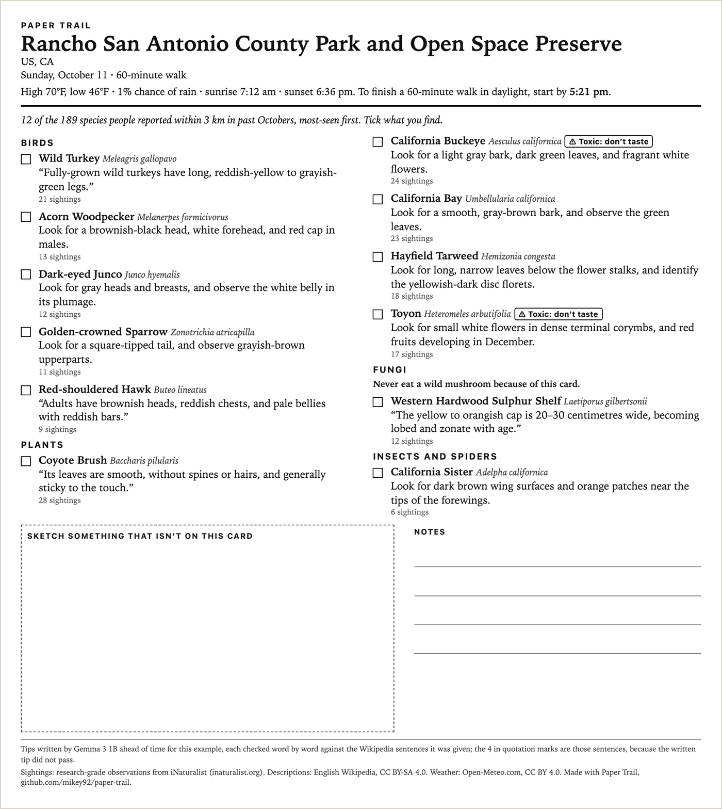
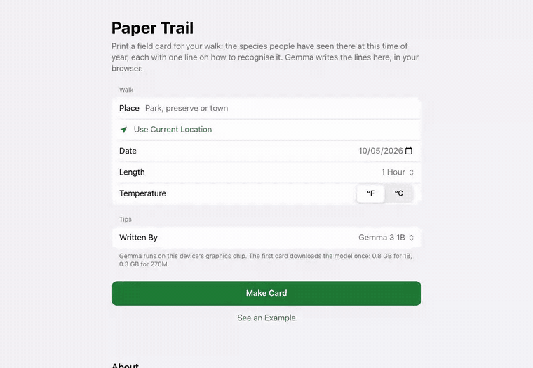

# Paper Trail

**A printed field card for this week's walk, written by Gemma in your browser.**

Live: **https://paper-trail.mikey9220.workers.dev** · Write-up: [on DEV](https://dev.to/mike_kim_692aa79c288bfed8/paper-trail-gemma-writes-your-walk-a-field-card-then-the-screen-goes-away-3mf4) · Evaluation: [eval/EVAL.md](eval/EVAL.md) · Hand review: [eval/REVIEW.md](eval/REVIEW.md)

Tell it where and when. It finds the species people actually reported there in past years at this
time of year (iNaturalist), reads what each one looks like (Wikipedia), and has **Gemma 3 1B, running
in a Web Worker on your own GPU**, write one line on how to recognise each. Every line is checked
against the Wikipedia sentences it was written from before it can reach the card; a line that fails
is retried once with the rejected words named, and if it fails again the card quotes Wikipedia
instead. You get one page with checkboxes, a box to sketch in, the weather and the time to start by
to finish in daylight. Print it and put the phone away.





## Run it

```sh
npm install
npm run dev        # http://localhost:5173
npm test           # unit tests, no network, no model
npm run build      # static site in dist/
```

No server and no API keys. Gemma's weights (763 MB for 1B) come from the Hugging Face Hub the first
time and then stay in the browser's cache. Without WebGPU the page quotes Wikipedia by default,
because Gemma on one CPU thread takes minutes per card; the models are still one click away.

## How it works

| Step | Source | Code |
|---|---|---|
| Find the place | iNaturalist places: parks and preserves, not just towns; radius from the place's size | `src/data.ts` |
| What people saw there | iNaturalist species counts for the month, any year, research grade | `src/data.ts` |
| Which twelve | Birds ~40%, plants ~40%, at least one fungus and one insect, most-reported first | `src/select.ts` |
| What each looks like | The Description section (and its subsections) of the English Wikipedia article; only sentences about colour, shape, sound or smell, without measurements, years, conservation status, comparisons with other species, or taste | `src/wiki.ts` |
| One line each | Gemma 3 1B (`onnx-community/gemma-3-1b-it-ONNX-GQA`, q4f16) via Transformers.js, greedy decoding | `src/llm.ts`, `src/worker.ts` |
| Is the line true to its source? | Every content word in the sentences; every colour next to the same part with no other colour in between; no numbers; no taste; "listen for" needs a sound | `src/ground.ts` |
| Warnings | Rash, poison or venom in the lead, description or a Toxicity section; a fixed line over every list of fungi | `src/wiki.ts`, `src/card.ts` |
| The page you print | Weather, sunrise and sunset from Open-Meteo; start-by time; sketch box; sources | `src/card.ts` |

`eval/run.ts` runs the same `writeTips()` the page uses, in Node, over six places on three continents.

## Data and licences

- Code: MIT.
- Sightings: [iNaturalist](https://www.inaturalist.org) research-grade observations, through its public API.
- Descriptions: English Wikipedia, CC BY-SA 4.0. Tips are derived from those articles and quotes are taken from them.
- Weather and sun times: [Open-Meteo](https://open-meteo.com), CC BY 4.0.
- Model: [Gemma 3](https://ai.google.dev/gemma) under the Gemma Terms of Use; ONNX exports by onnx-community.
